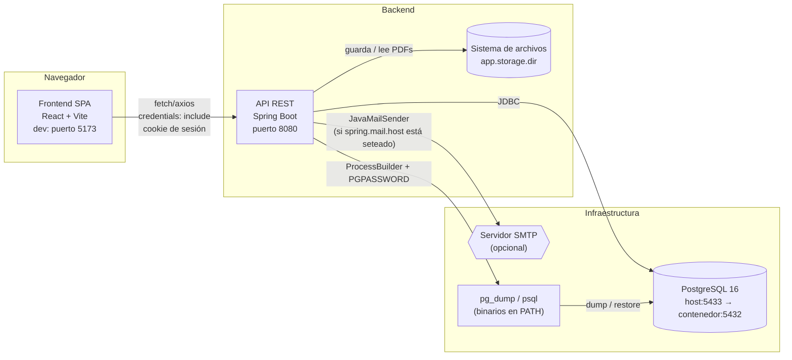
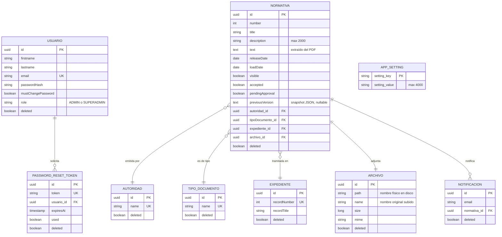
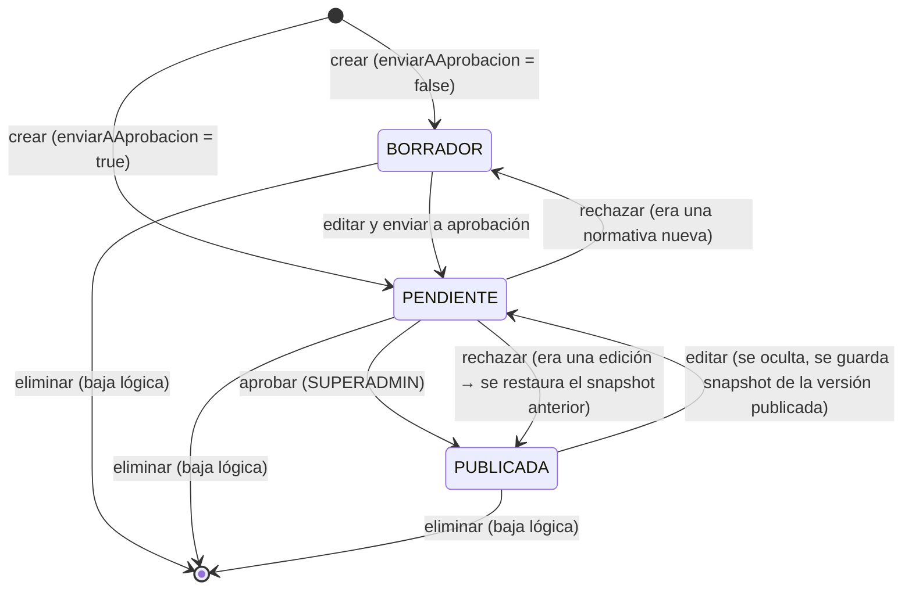
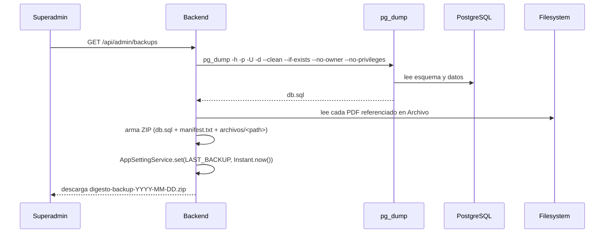
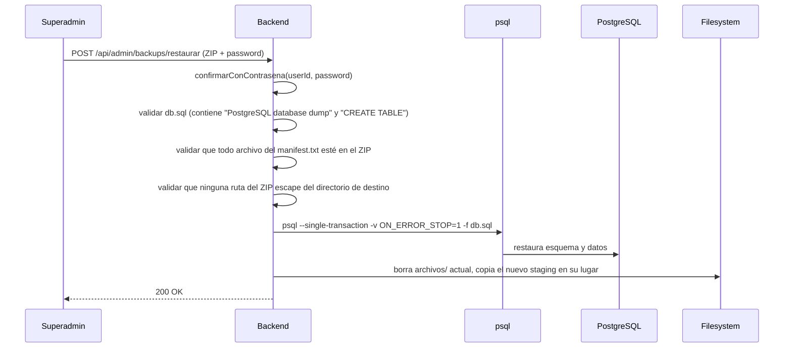

# Digesto — Escuela de Comercio Martín Zapata

Sistema de publicación y gestión de normativas institucionales para la Escuela de Comercio Martín Zapata, anexa a la Universidad Nacional de Cuyo (UNCuyo). Permite cargar, aprobar, publicar y buscar normativas (disposiciones, resoluciones, circulares) en PDF, con un flujo de aprobación de dos roles y backups completos de base de datos + archivos.

> **Estado de esta documentación**: refleja el código post-limpieza y fue contrastada con una ejecución local del backend, PostgreSQL y frontend. Los flujos que requieren una base nueva, SMTP real o datos de producción se indican explícitamente como pendientes de verificación.

## Índice

1. [Descripción general](#1-descripción-general)
2. [Arquitectura del sistema](#2-arquitectura-del-sistema)
3. [Estructura del repositorio](#3-estructura-del-repositorio)
4. [Requisitos previos](#4-requisitos-previos)
5. [Configuración y variables de entorno](#5-configuración-y-variables-de-entorno)
6. [Puesta en marcha local](#6-puesta-en-marcha-local)
7. [Backend — Lógica interna](#7-backend--lógica-interna)
8. [Frontend — Lógica interna](#8-frontend--lógica-interna)
9. [API REST — Referencia](#9-api-rest--referencia)
10. [Base de datos](#10-base-de-datos)
11. [Seguridad](#11-seguridad)
12. [Backups y restauración](#12-backups-y-restauración)
13. [Despliegue en producción](#13-despliegue-en-producción)
14. [Testing](#14-testing)
15. [Troubleshooting](#15-troubleshooting)
16. [Glosario](#16-glosario)
17. [Hallazgos de la revisión de código y pendientes](#17-hallazgos-de-la-revisión-de-código-y-pendientes)

---

## 1. Descripción general

**Digesto** resuelve un problema concreto: centralizar y publicar las normativas de la institución (resoluciones, disposiciones, circulares) en un sitio público consultable, con un panel administrativo donde el personal autorizado carga los documentos y un superadministrador los aprueba antes de que se hagan visibles.

### 1.1 Stack tecnológico

| Capa | Tecnología |
|---|---|
| Backend | Spring Boot (parent `4.1.0`), Java 25, Maven |
| Persistencia | Spring Data JPA / Hibernate sobre PostgreSQL 16 |
| Seguridad | Spring Security, autenticación por **sesión HTTP + cookie** (no JWT) |
| PDFs | Apache PDFBox `3.0.8` (extracción de texto para búsqueda) |
| Correo | Spring Mail (`JavaMailSender`) sobre SMTP |
| Serialización auxiliar | `tools.jackson.core:jackson-databind` `3.1.4` (Jackson 3.x, group id nuevo) — usado solo para serializar/deserializar los *snapshots* de versiones previas de una normativa |
| Backups | `pg_dump` / `psql` invocados como procesos externos |
| Frontend | React 19, Vite 8, TypeScript, Tailwind CSS 3 |
| Routing frontend | React Router v7 |
| Formularios | React Hook Form (validación **nativa** del propio hook, sin Zod ni ningún resolver de esquemas) |
| Cliente HTTP frontend | Axios (`withCredentials: true`) — no hay TanStack Query ni SWR |
| Iconografía | lucide-react |
| Testing frontend | Vitest + Testing Library (jsdom) |
| Linter frontend | oxlint (no ESLint, no Prettier) |
| Contenedores | Docker Compose solo para PostgreSQL |

No hay información en el código sobre equipo, materia o cliente formal del proyecto (no se encontró ningún archivo de documentación de cátedra/equipo en el código fuente provisto); por lo tanto esa parte queda **pendiente** de completar por quien mantenga el repositorio.

---

## 2. Arquitectura del sistema



**Responsabilidad de cada componente:**

- **Frontend SPA**: única interfaz de usuario, sirve tanto el sitio público como el panel administrativo bajo el mismo build. No tiene lógica de negocio sensible: todas las reglas (unicidad, permisos, estados) se validan en el backend.
- **Backend API REST**: expone endpoints bajo `/api/**`, contiene toda la lógica de negocio, autenticación, autorización y orquestación de backups.
- **PostgreSQL**: única fuente de verdad de datos estructurados (normativas, usuarios, catálogos, configuración).
- **Sistema de archivos local** (`app.storage.dir`): almacena los PDFs con nombre aleatorio (UUID), fuera del control de versiones.
- **SMTP**: opcional. Si `spring.mail.host` no está configurado, `MailService.send()` no envía nada y solo lo registra en el log (`log.warn`), devolviendo `false`.
- **`pg_dump` / `psql`**: procesos externos invocados vía `ProcessBuilder` para generar y restaurar backups completos de la base.

### 2.1 Comunicación entre componentes

- **Frontend ↔ Backend**: HTTP(S), JSON para la mayoría de los endpoints, `multipart/form-data` para creación/edición de normativas (JSON + PDF) y para restaurar backups (ZIP + contraseña).
- **Autenticación**: sesión HTTP clásica. El login (`POST /api/auth/login`) autentica con `AuthenticationManager`, guarda el `SecurityContext` explícitamente en la sesión HTTP (`HttpSessionSecurityContextRepository`, necesario desde Spring Security 6 porque ya no se persiste automáticamente) y el servidor responde con la cookie de sesión (`Set-Cookie`). El frontend nunca maneja tokens: todas las llamadas usan `axios` con `withCredentials: true` para que el navegador reenvíe la cookie. **No hay JWT en ningún punto del sistema.**
- **CORS**: configurado en `SecurityConfig.corsConfigurationSource()`, origenes tomados de `app.cors-origins` (lista separada por comas), métodos `GET, POST, PUT, DELETE, PATCH, OPTIONS`, todos los headers permitidos, header `Content-Disposition` expuesto (necesario para que el frontend lea el nombre de archivo de las descargas), `allowCredentials(true)`.

---

## 3. Estructura del repositorio

```
digesto-ecmz/
├── backend/
│   ├── pom.xml
│   ├── docker-compose.yaml          # solo PostgreSQL
│   ├── .gitattributes
│   └── src/main/
│       ├── resources/application.properties
│       └── java/ar/edu/uncuyo/mzapata/digesto/
│           ├── DigestoApplication.java        # @SpringBootApplication, @EnableAsync, @ConfigurationPropertiesScan
│           ├── auth/            # login, sesión, reset de contraseña
│           ├── user/            # ABM de usuarios administrativos
│           ├── normativa/       # entidad central: Normativa, DTOs, servicio, repositorio
│           ├── autoridad/       # catálogo de autoridades emisoras
│           ├── tipodocumento/   # catálogo de tipos de normativa
│           ├── expediente/      # expedientes administrativos referenciados por una normativa
│           ├── archivo/         # almacenamiento y extracción de texto de PDFs
│           ├── setting/         # configuración editable (plantilla de correo, fecha de último backup)
│           ├── backup/          # generación y restauración de backups
│           ├── mail/            # envío de correo (wrapper sobre JavaMailSender)
│           ├── entity/          # BaseEntity (id UUID + borrado lógico)
│           └── config/          # AppProperties, SecurityConfig, ApiExceptionHandler, BusinessException, DataSeeder
│
└── frontend/
    ├── package.json / package-lock.json
    ├── vite.config.ts
    ├── tailwind.config.js / postcss.config.js
    ├── tsconfig*.json
    ├── index.html
    ├── .env.development
    └── src/
        ├── main.tsx / App.tsx
        ├── api/                     # http.ts (cliente axios), auth.ts, normativas.ts, usuarios.ts, backups.ts, autoridades.ts, tiposDocumento.ts, settings.ts
        ├── context/                 # AuthContext, ToastContext
        ├── hooks/                   # useAuth, useToast, useAsyncData, useNormativaActions
        ├── layouts/                 # PublicLayout, AdminLayout
        ├── pages/
        │   ├── public/              # HomePage, NormativaDetailPage
        │   ├── auth/                # LoginPage, ForgotPasswordPage, ResetPasswordPage
        │   └── admin/                # normativas, catálogos, usuarios, backups, plantilla de correo, cambio de contraseña
        ├── components/              # AdminSidebar, AuthCard, FileDropzone, NormativaResults, ToastContainer, ui/*
        ├── types/                   # espejo TypeScript de los DTOs del backend
        ├── utils/                   # errors.ts, format.ts
        └── test/                    # setup.ts, renderWithAuth.tsx + *.test.ts(x)
```

---

## 4. Requisitos previos

| Herramienta | Versión / notas |
|---|---|
| Java | 25 (definido en `pom.xml` → `<java.version>25</java.version>`) |
| Maven | vía `./mvnw` (`mvnw` y `mvnw.cmd` están en `backend/`) |
| Node.js | Compatible con Vite 8 / React 19 (recomendado Node ≥ 20) |
| npm | El proyecto trae `package-lock.json` (lockfile v3) |
| Docker + Docker Compose | Para levantar PostgreSQL con `backend/docker-compose.yaml` |
| PostgreSQL 16 | Si no se usa Docker, instalar y crear la base `digesto` manualmente |
| Cliente SMTP | Opcional. Sin configurar, los correos solo se loguean (ver §5.6) |
| `pg_dump` y `psql` | Deben estar en el `PATH` del proceso del backend (o configurados vía `PG_DUMP`/`PSQL`) para que funcionen los backups |

---

## 5. Configuración y variables de entorno

### 5.1 Backend (`application.properties`)

| Propiedad | Variable de entorno | Valor por defecto | Descripción |
|---|---|---|---|
| `spring.datasource.url` | — (hardcodeado) | `jdbc:postgresql://localhost:5433/digesto` | URL JDBC. **Fijo en el código**, no parametrizado por env var — ver §17 |
| `spring.datasource.username` | — (hardcodeado) | `postgres` | Usuario de la base |
| `spring.datasource.password` | — (hardcodeado) | `postgres` | Contraseña de la base — **credencial de desarrollo, no usar en producción** |
| `spring.jpa.hibernate.ddl-auto` | — | `update` | Ver implicancias en §10.3 |
| `spring.servlet.multipart.max-file-size` | — | `50MB` | Tamaño máximo de PDF |
| `spring.servlet.multipart.max-request-size` | — | `50MB` | Tamaño máximo de request completo |
| `spring.mail.host` | `MAIL_HOST` | *(vacío)* | Si vacío, no se envían correos (se loguean) |
| `spring.mail.port` | `MAIL_PORT` | `587` | Puerto SMTP |
| `spring.mail.username` | `MAIL_USERNAME` | *(vacío)* | Usuario SMTP |
| `spring.mail.password` | `MAIL_PASSWORD` | *(vacío)* | Contraseña SMTP |
| `app.auth.password-reset.duration-minutes` | — | `60` | Vigencia del link de recuperación de contraseña |
| `app.cors-origins` | — | `https://digesto.mzapata.uncuyo.edu.ar,http://localhost:5173` | Orígenes permitidos por CORS (lista separada por comas) |
| `app.frontend-url` | — | `https://digesto.mzapata.uncuyo.edu.ar` | Usada para armar el enlace en el correo de notificación de normativa aprobada |
| `app.api-url` | — | `https://api.digesto.mzapata.uncuyo.edu.ar` | Declarada en `AppProperties` pero **no se encontró ningún uso** en el código provisto — ver §17 |
| `app.storage.dir` | `STORAGE_DIR` | `./data/archivos` | Carpeta donde se guardan los PDFs |
| `app.mail.from` | `MAIL_FROM` | `digesto@mzapata.uncuyo.edu.ar` | Remitente de los correos salientes |
| `app.backup.pg-dump` | `PG_DUMP` | `pg_dump` | Ruta/nombre del binario |
| `app.backup.psql` | `PSQL` | `psql` | Ruta/nombre del binario |
| `app.backup.alert-months` | — | `6` | Meses sin backup antes de mostrar alerta al SUPERADMIN |

> ⚠️ `spring.datasource.url/username/password` están **hardcodeados** en `application.properties`, a diferencia del resto de las propiedades sensibles que sí usan variables de entorno con `${VAR:default}`. Para producción es imprescindible parametrizarlos (ver §13).

### 5.2 Frontend (`.env`)

| Variable | Valor en `.env.development` | Descripción |
|---|---|---|
| `VITE_API_URL` | `http://localhost:8080` | Base URL usada por el cliente axios (`src/api/http.ts`) |

No existe un `.env.production` en el código provisto — pendiente de crear para el build de producción (ver §13).

### 5.3 Docker Compose (`backend/docker-compose.yaml`)

```yaml
services:
  postgres:
    image: postgres:16
    container_name: digesto-postgres
    environment:
      POSTGRES_USER: postgres
      POSTGRES_PASSWORD: postgres
      POSTGRES_DB: digesto
    ports:
      - "5433:5432"
    volumes:
      - digesto_postgres_data:/var/lib/postgresql/data
```

Solo levanta PostgreSQL — no hay definición de servicio para el backend ni el frontend en este `docker-compose.yaml` (ver recomendaciones de producción en §13).

### 5.4 Puertos utilizados

| Servicio | Puerto | Notas |
|---|---|---|
| Backend (Spring Boot) | `8080` | Puerto por defecto, no hay `server.port` explícito en `application.properties` |
| Frontend (Vite dev server) | `5173` | Definido en `vite.config.ts` (`server.port`) |
| PostgreSQL | `5433` (host) → `5432` (contenedor) | El mapeo a `5433` explica por qué la URL JDBC usa ese puerto aun en local |
| SMTP | `587` | Por defecto (STARTTLS) |

### 5.5 Almacenamiento de archivos

Los PDFs se guardan en `app.storage.dir` (por defecto `./data/archivos`, relativo al directorio de trabajo del proceso backend). `ArchivoService.store()` genera un nombre único `UUID.randomUUID() + ".pdf"` y lo copia ahí; el nombre original que subió el usuario se conserva solo en la columna `Archivo.name` de la base, no en el disco. Los archivos **nunca se borran del disco** al eliminar una normativa (baja lógica) ni al reemplazar el PDF en una edición.

### 5.6 Correo

Si `spring.mail.host` (`MAIL_HOST`) no está seteado, `MailService.send()` no intenta conectarse a ningún SMTP: solo registra `log.warn("SMTP sin configurar. Correo NO enviado a {} con asunto '{}'", ...)` y devuelve `false`. Esto es intencional para desarrollo, pero implica que en ese modo **no se puede probar de punta a punta** el flujo de recuperación de contraseña ni las notificaciones de aprobación salvo leyendo los logs.

Para configurar un SMTP real (ejemplo Gmail con contraseña de aplicación):

```bash
export MAIL_HOST=smtp.gmail.com
export MAIL_PORT=587
export MAIL_USERNAME=tu-cuenta@gmail.com
export MAIL_PASSWORD=xxxx-xxxx-xxxx-xxxx
export MAIL_FROM=digesto@mzapata.uncuyo.edu.ar
```

---

## 6. Puesta en marcha local

```bash
# 1. Clonar el repositorio
git clone <url-del-repo> digesto-ecmz
cd digesto-ecmz

# 2. Levantar PostgreSQL
cd backend
docker compose up -d
# verificar: psql -h localhost -p 5433 -U postgres -d digesto

# 3. (Opcional) configurar variables de entorno de correo/backup
# export MAIL_HOST=... STORAGE_DIR=... PG_DUMP=... PSQL=...

# 4. Compilar y levantar el backend
./mvnw spring-boot:run
# Backend disponible en http://localhost:8080

# 5. En otra terminal, instalar dependencias del frontend
cd ../frontend
npm install

# 6. Levantar el frontend
npm run dev
# Frontend disponible en http://localhost:5173
```

### 6.1 Datos iniciales (`DataSeeder`)

Al arrancar, `DataSeeder implements CommandLineRunner` crea de forma **idempotente** (verifica existencia antes de insertar):

**Tipos de normativa:**
- Disposición
- Resolución
- Circular

**Autoridades:**
- Dirección
- Vicedirección
- Consejo Directivo
- Secretaría Académica

**Usuarios administrativos:**

| Email | Contraseña | Rol | `mustChangePassword` |
|---|---|---|---|
| `admin@mzapata.uncuyo.edu.ar` | `admin` | `ADMIN` | `true` |
| `superadmin@mzapata.uncuyo.edu.ar` | `superadmin` | `SUPERADMIN` | `true` |

> ⚠️ Son credenciales de **desarrollo**. El sistema fuerza el cambio de contraseña en el primer login (`ProtectedRoute` redirige a `/admin/cambiar-password` mientras `mustChangePassword === true`), pero igual no deben usarse tal cual en un ambiente expuesto públicamente.

---

## 7. Backend — Lógica interna

### 7.1 Capas y organización de paquetes

El backend sigue una organización **por dominio** (no por capa técnica): cada paquete (`normativa`, `user`, `backup`, etc.) contiene su propia entidad, repositorio, servicio, DTOs y controlador. Dentro de cada paquete sí se respeta la separación Controller → Service → Repository → Entity, con DTOs dedicados para request/response.

### 7.2 Autenticación y autorización

- **Sesión HTTP + cookie**, sin JWT. `AuthController.login()` arma la `Authentication` manualmente con `authenticationManager.authenticate(new UsernamePasswordAuthenticationToken(...))`, la guarda en un `SecurityContext` nuevo y lo persiste explícitamente con `HttpSessionSecurityContextRepository.saveContext(...)` (necesario porque desde Spring Security 6 esto ya no ocurre automáticamente al final del request).
- `CustomUserDetailsService.loadUserByUsername()` busca por `findByEmailAndDeletedFalse` y arma un `CustomUserDetails` con `id`, `email`, `passwordHash`, `roles` (lista de un solo `UserRole`) y `mustChangePassword`.
- **Roles**: `ADMIN` y `SUPERADMIN` (enum `UserRole`). Un usuario tiene **un único rol** (no es una lista real de roles pese a que el modelo lo expone como `Collection<UserRole>`).
- **Reglas de acceso** (`SecurityConfig`):
  - Público (`permitAll`): `GET /api/normativas/**`, `GET /api/tipos-documento/**`, `GET /api/autoridades/**`, `POST /api/auth/login`, `POST /api/auth/forgot-password`, `POST /api/auth/reset-password`, `/error`.
  - Todo lo demás: `authenticated()`.
  - Reglas más finas por rol se agregan con `@PreAuthorize` a nivel clase/método (ver tabla completa en §9).
- **Contraseñas**: `BCryptPasswordEncoder`.
- **Recuperación de contraseña**: `PasswordService.forgot()` genera un `PasswordResetToken` (UUID como token, no JWT) con expiración `app.auth.password-reset.duration-minutes`, lo manda por correo con un link a `{frontendUrl}/reset-password?token=...`. El endpoint no revela si el email existe o no (siempre responde 200). El token es de un solo uso (`used`).

### 7.3 Modelo de datos (diagrama entidad-relación)



Todas las entidades (excepto `AppSetting`) extienden `BaseEntity`: `id` (`UUID`, `@GeneratedValue` sin estrategia explícita → estrategia por defecto del proveedor JPA) y `deleted` (borrado lógico, `boolean`, default `false`).

**Estado calculado de una normativa** (`Normativa.estado()`, no persistido como columna separada):

```java
public String estado() {
    if (accepted && visible) return "PUBLICADA";
    if (pendingApproval) return "PENDIENTE";
    return "BORRADOR";
}
```

### 7.4 Flujo de estados de una normativa



Puntos clave de `NormativaService`:

- **Snapshot de versión previa**: al editar una normativa que está `accepted && visible` (o sea, `PUBLICADA`) y que todavía no tiene un `previousVersion` guardado, se serializa el estado actual completo (`NormativaSnapshot`, vía Jackson) **antes** de aplicar los cambios del formulario. Si se edita de nuevo mientras sigue pendiente de aprobación, el snapshot **no se pisa** (la condición exige `accepted && visible`, que ya es `false` después de la primera edición), preservando siempre la última versión realmente publicada.
- **Aprobar** (`approve`, solo `SUPERADMIN`): exige `pendingApproval == true`; setea `accepted = true`, `visible = true`, `pendingApproval = false`, limpia `previousVersion`; envía las notificaciones por correo y devuelve la lista de direcciones que fallaron (`AprobacionResultDto.notificacionesFallidas`) sin abortar el resto del envío.
- **Rechazar** (`reject`, solo `SUPERADMIN`): exige `pendingApproval == true`. Si había `previousVersion` (era una edición de algo publicado), restaura todos los campos desde el snapshot y vuelve a marcar `accepted = true, visible = true` (la publicación anterior queda como si nunca se hubiera editado). Si no había snapshot (era una normativa nueva), simplemente queda en `BORRADOR`. En ambos casos se le avisa por correo a quien la creó (`createdBy`), con el motivo si se indicó.
- **Eliminar** (`delete`): baja lógica (`deleted = true`, `visible = false`, `pendingApproval = false`). El PDF y los registros de `Archivo`/`Expediente`/`Notificacion` asociados **no se borran**.
- **Unicidad**: `(YEAR(releaseDate), number, tipoDocumentoId)` debe ser único entre normativas no eliminadas (`NormativaRepository.existsDuplicate`, excluyendo el propio id al editar).
- **`recordNumber` de expediente**: si el número ya existe, se **reutiliza el `Expediente` existente completo**, incluyendo su `recordTitle` original — el título ingresado en el formulario en ese caso se descarta silenciosamente (ver hallazgo en §17). El frontend solo muestra una advertencia informativa (`expedienteEnUso`), no bloquea el guardado.

### 7.5 Servicios principales

| Servicio | Responsabilidad |
|---|---|
| `NormativaService` | Búsqueda pública/admin, CRUD, aprobación/rechazo, snapshots, notificaciones |
| `UsuarioService` | ABM de usuarios administrativos; genera contraseña aleatoria (`SecureRandom`, 9 bytes → Base64 URL-safe) y la envía por correo al crear |
| `AutoridadService` / `TipoDocumentoService` | ABM de catálogos con unicidad case-insensitive y protección contra borrado si hay normativas que los referencian |
| `ArchivoService` | Guarda PDFs en disco con nombre UUID, valida tipo MIME (`application/pdf`) y presencia, arma la `ResponseEntity` (inline o adjunto), extrae texto con PDFBox (`PDFTextStripper`), devuelve cadena vacía si el PDF no tiene capa de texto |
| `MailService` | Envío de correo simple (`SimpleMailMessage`); devuelve `boolean` de éxito, nunca lanza excepción hacia arriba por un fallo de envío individual |
| `PasswordService` | Cambio de contraseña propia, "olvidé mi contraseña" (no revela si el email existe), reset con token |
| `AppSettingService` | Clave-valor genérico (`AppSetting`) usado para la plantilla de correo y la fecha del último backup |
| `BackupService` | Generación del ZIP de backup, restauración validada, cálculo de alerta por antigüedad |
| `DataSeeder` | Carga inicial idempotente (tipos, autoridades, usuarios) |

### 7.6 Manejo de errores

- `BusinessException(HttpStatus status, String message)` — excepción de negocio con `BusinessException.notFound(msg)` como fábrica para 404.
- `ApiExceptionHandler` (`@RestControllerAdvice`):

| Excepción | Status | Body |
|---|---|---|
| `BusinessException` | El que trae la excepción (400 por defecto, 404 vía `notFound()`) | `{ "message": "..." }` |
| `BadCredentialsException` | 401 | `{ "message": "Email o contraseña incorrectos" }` |
| `MethodArgumentNotValidException` | 400 | `{ "message": "Revise los campos del formulario", "errors": { "campo": "mensaje" } }` |
| `NoResourceFoundException` | 404 | `{ "message": "El recurso no existe" }` |
| `HttpRequestMethodNotSupportedException` | 405 | `{ "message": "El método HTTP no está permitido para este recurso" }` |
| `Exception` (genérica) | 500 | `{ "message": "Ocurrió un error interno" }` — no expone stacktrace |

Además, `SecurityConfig` configura `exceptionHandling().authenticationEntryPoint(new HttpStatusEntryPoint(HttpStatus.UNAUTHORIZED))`, así que un request no autenticado a un recurso protegido devuelve 401 sin cuerpo JSON adicional del `ApiExceptionHandler`.

### 7.7 Auditoría y transacciones

- `@EnableJpaAuditing(auditorAwareRef = "auditorAware")` + `@EntityListeners(AuditingEntityListener.class)` en `Normativa`: completa `createdAt`, `updatedAt`, `createdBy`, `updatedBy` automáticamente.
- `AuditorAware<UUID>` lee el `CustomUserDetails` del `SecurityContext` actual.
- Todos los métodos de solo lectura están anotados `@Transactional(readOnly = true)`; los de escritura, `@Transactional`.
- **Excepción deliberada**: `BackupService.restore()` **no** está dentro de una transacción JPA — tiene sentido porque recrea el esquema completo por fuera de Hibernate (`psql` directo), pero implica que no hay rollback automático a nivel aplicación si algo falla a mitad de camino (ver riesgo en §17).

### 7.8 Extracción de texto de PDFs

`ArchivoService.extractText()` usa `Loader.loadPDF(...)` + `PDFTextStripper` de PDFBox. Si el PDF no tiene capa de texto (por ejemplo, un escaneo sin OCR) o falla la lectura, captura la `IOException`, loguea un warning y devuelve cadena vacía — **no hay OCR implementado**, por lo que esos documentos no serán encontrados por la búsqueda de texto libre.

---

## 8. Frontend — Lógica interna

### 8.1 Stack real (aclaración importante)

El stack **efectivamente usado** difiere de lo que suele asumirse por defecto en proyectos similares — documentado acá tal cual está en el código, no como "debería estar":

| Se podría asumir | Lo que realmente usa el código |
|---|---|
| TanStack Query / SWR | Hook propio `useAsyncData` (`src/hooks/useAsyncData.ts`): ejecuta el fetcher al montar y cuando cambian las `deps`, ignora respuestas obsoletas, expone `reload()` manual. Sin cache entre componentes, sin invalidación automática. |
| Zod + resolver | Validación **nativa** de `react-hook-form` (`required`, `pattern`, `validate`, `minLength`) directamente en cada `register(...)`. No hay ningún archivo de esquemas. |
| date-fns | `Intl.DateTimeFormat('es-AR', ...)` (`src/utils/format.ts`), con un `parseLocalDate` casero para evitar el corrimiento de día por UTC al parsear `LocalDate` de Java como string `"YYYY-MM-DD"`. |
| ESLint + Prettier | **oxlint** (`npm run lint`); no hay configuración de ESLint ni Prettier en el repo. |
| Modo oscuro | No implementado — no hay clases `dark:` en Tailwind ni lógica de tema. |

### 8.2 Rutas y guardas

```mermaid
flowchart TD
    Root["/"] --> Home[HomePage]
    Root --> Detail["/normativas/:id"]
    Login["/login"]
    Forgot["/forgot-password"]
    Reset["/reset-password"]

    Admin["/admin (ProtectedRoute)"] --> AIndex["index → redirect a /admin/normativas"]
    Admin --> AList["/admin/normativas"]
    Admin --> ANew["/admin/normativas/nueva"]
    Admin --> APend["/admin/normativas/pendientes (RoleRoute SUPERADMIN)"]
    Admin --> ADetail["/admin/normativas/:id"]
    Admin --> AEdit["/admin/normativas/:id/editar"]
    Admin --> ATipos["/admin/tipos-documento"]
    Admin --> AAut["/admin/autoridades"]
    Admin --> AUsers["/admin/usuarios (RoleRoute SUPERADMIN)"]
    Admin --> ABackups["/admin/backups (RoleRoute SUPERADMIN)"]
    Admin --> AMail["/admin/configuracion/correo"]
    Admin --> APass["/admin/cambiar-password"]

    NotFound["* → NotFoundPage"]
```



- **`ProtectedRoute`**: mientras `initializing` (chequeo inicial de `GET /api/auth/me`), muestra `LoadingState`. Si no hay usuario, redirige a `/login` guardando `location` en el state para volver después del login. Si `user.mustChangePassword` es `true` y la ruta actual no es `/admin/cambiar-password`, fuerza la redirección ahí.
- **`RoleRoute`**: si `!hasRole(role)`, redirige a `/admin/normativas` (no muestra un error, simplemente saca al usuario de esa sección).

### 8.3 Cliente API y manejo de sesión

`src/api/http.ts` crea una instancia de axios (`baseURL: VITE_API_URL`, `withCredentials: true`). Un interceptor de respuesta normaliza **todos** los errores a una clase `ApiError extends Error` con `status`, `message` y `fieldErrors?`. Casos manejados:

- Si el body de error viene como `Blob` (pasa con requests `responseType: 'blob'`, como la descarga de backup), lo relee como texto y lo parsea como JSON para recuperar el mensaje real del backend.
- Si no hay body de error interpretable, usa un mensaje por defecto según el status (`defaultMessageFor`), con textos específicos para 400/401/403/404/409/0 (sin conexión).

`authApi.me()` atrapa cualquier error y devuelve `null` (no propaga `ApiError`) — así `AuthProvider` puede distinguir "no hay sesión" de un error real sin lógica adicional.

### 8.4 Componentes y hooks destacados

- **`AdminLayout`**: sidebar + topbar; si el usuario tiene rol `SUPERADMIN`, consulta `backupsApi.estado()` al montar y muestra un banner de alerta si hace más de `mesesDeAlerta` que no hay backup (falla silenciosamente si el chequeo da error, "no crítico" según el comentario en el código).
- **`useNormativaActions`**: centraliza los diálogos de confirmación de eliminar/aprobar/rechazar y sus llamadas a la API, reutilizado tanto en la lista como en el detalle de normativa, para que ambas pantallas se comporten igual.
- **`FileDropzone`**: input de archivo estilizado, valida cliente-side tamaño máximo (50 MB, duplicando la constante del backend) y tipo `application/pdf`.
- **`CatalogPage`**: componente genérico parametrizable (`title`, `noun`, `article`, `api`) reutilizado tanto para Tipos de Normativa como para Autoridades — evita duplicar el ABM.
- **Toasts**: `ToastProvider` con auto-dismiss (4.5 s éxito/info, 7 s error), sin dependencias externas.

### 8.5 Diseño visual

- Color institucional `#0355a7` (con variantes `dark`, `50`, `100`) definido en `tailwind.config.js`.
- Tipografías: `Source Sans 3` (texto) y `Source Serif 4` (títulos, clase `.font-display`), cargadas desde Google Fonts en `index.html`.
- Layout responsive: la tabla de normativas (`NormativaResults`) se oculta en mobile (`hidden md:block`) y se reemplaza por una lista de tarjetas (`md:hidden`).
- Accesibilidad: uso consistente de `aria-label`, `aria-live`, `role="alert"/"status"`, foco visible (`:focus-visible` con el color institucional), reducción de movimiento respetada (`prefers-reduced-motion`).

---

## 9. API REST — Referencia

Todas las rutas cuelgan de `VITE_API_URL` (en dev, `http://localhost:8080`). Formato de error estándar en §7.6.

### 9.1 Autenticación — `/api/auth`

| Método | Ruta | Auth | Descripción |
|---|---|---|---|
| POST | `/login` | pública | Autentica y crea la sesión |
| POST | `/logout` | autenticado | Invalida la sesión HTTP |
| GET | `/me` | autenticado | Usuario actual |
| POST | `/change-password` | autenticado | Cambia la contraseña propia |
| POST | `/forgot-password` | pública | Solicita link de recuperación (no revela si el email existe) |
| POST | `/reset-password` | pública | Aplica la nueva contraseña con el token recibido por correo |

**Ejemplo — login:**

```bash
curl -i -c cookies.txt -X POST http://localhost:8080/api/auth/login \
  -H "Content-Type: application/json" \
  -d '{"email":"superadmin@mzapata.uncuyo.edu.ar","password":"superadmin"}'
```

```json
{
  "userId": "3f2a1b90-...",
  "roles": ["SUPERADMIN"],
  "mustChangePassword": true
}
```

### 9.2 Sitio público

| Método | Ruta | Auth | Descripción |
|---|---|---|---|
| GET | `/api/normativas` | pública | Búsqueda paginada (solo `PUBLICADA`) |
| GET | `/api/normativas/{id}` | pública | Detalle público (404 si no está publicada) |
| GET | `/api/normativas/{id}/archivo?download=false\|true` | pública | Ver/descargar el PDF |
| GET | `/api/tipos-documento` | pública | Listado de tipos |
| GET | `/api/autoridades` | pública | Listado de autoridades |

**Filtros de búsqueda** (`NormativaFilterDto`, todos opcionales): `q`, `tipoDocumentoId`, `autoridadId`, `anio`, `number`, `recordNumber`, `desde`, `hasta` (ISO date). Paginación estándar de Spring Data: `page`, `size`, `sort=propiedad,DIRECCION` (default público: `releaseDate,DESC`; default admin: `loadDate,DESC`).

**Ejemplo — búsqueda:**

```bash
curl "http://localhost:8080/api/normativas?q=reglamento&anio=2026&page=0&size=10&sort=releaseDate,DESC"
```

```json
{
  "content": [
    {
      "id": "b7e0...",
      "number": 145,
      "title": "Reglamento Interno 2026",
      "description": "...",
      "releaseDate": "2026-04-09",
      "loadDate": "2026-03-20",
      "tipoDocumento": "Resolución",
      "autoridad": "Dirección",
      "archivoName": "reglamento-145.pdf",
      "archivoSize": 245678,
      "estado": "PUBLICADA"
    }
  ],
  "totalElements": 1,
  "totalPages": 1,
  "number": 0,
  "size": 10,
  "first": true,
  "last": true,
  "numberOfElements": 1,
  "empty": false
}
```

### 9.3 Administración de normativas — `/api/admin/normativas`

`@PreAuthorize("isAuthenticated()")` a nivel clase; aprobar/rechazar exigen `SUPERADMIN`.

| Método | Ruta | Auth | Descripción |
|---|---|---|---|
| GET | `/` | autenticado | Listado admin (incluye borradores/pendientes); `?pendientes=true` filtra solo pendientes |
| GET | `/expediente-en-uso?numero=N` | autenticado | Chequeo informativo, no bloqueante |
| GET | `/{id}` | autenticado | Detalle admin (incluye `notificaciones`) |
| GET | `/{id}/archivo?download=` | autenticado | Ver/descargar PDF (cualquier estado) |
| POST | `/` | autenticado | Crear (multipart: parte `normativa` en JSON + parte `archivo` obligatoria) |
| PUT | `/{id}` | autenticado | Editar (parte `archivo` **opcional** — si se omite, se conserva el PDF actual) |
| DELETE | `/{id}` | autenticado | Baja lógica |
| POST | `/{id}/aprobar` | **SUPERADMIN** | Aprueba y publica; envía notificaciones |
| POST | `/{id}/rechazar?motivo=` | **SUPERADMIN** | Rechaza (restaura snapshot o vuelve a borrador) |

**Ejemplo — crear normativa** (multipart, dos partes: `normativa` como Blob `application/json` y `archivo` como el PDF):

```bash
curl -c cookies.txt -b cookies.txt -X POST http://localhost:8080/api/admin/normativas \
  -F 'normativa={"number":145,"title":"Reglamento Interno 2026","description":"...","releaseDate":"2026-04-09","autoridadId":"...","tipoDocumentoId":"...","recordNumber":10,"recordTitle":"Expediente inicial","notificaciones":["secretaria@mzapata.uncuyo.edu.ar"],"enviarAAprobacion":true};type=application/json' \
  -F 'archivo=@reglamento.pdf;type=application/pdf'
```

**Ejemplo — aprobar:**

```bash
curl -b cookies.txt -X POST http://localhost:8080/api/admin/normativas/b7e0.../aprobar
```

```json
{
  "normativa": { "...": "NormativaDetailDto con estado PUBLICADA" },
  "notificacionesFallidas": []
}
```

### 9.4 Catálogos — tipos de normativa y autoridades

| Método | Ruta | Auth |
|---|---|---|
| GET | `/api/tipos-documento` | pública |
| POST/PUT/DELETE | `/api/tipos-documento(/{id})` | autenticado (cualquier rol) |
| GET | `/api/autoridades` | pública |
| POST/PUT/DELETE | `/api/autoridades(/{id})` | autenticado (cualquier rol) |

Ambos catálogos: nombre único case-insensitive, no se puede eliminar si hay normativas que lo referencian (`BusinessException`: *"No se puede eliminar: hay normativas que usan esta autoridad/este tipo"*).

### 9.5 Usuarios — `/api/admin/usuarios` (solo `SUPERADMIN`)

| Método | Ruta | Descripción |
|---|---|---|
| GET | `/` | Listado (ordenado por apellido) |
| POST | `/` | Crea usuario, genera contraseña aleatoria y la envía por correo |
| PUT | `/{id}` | Edita datos (no permite cambiar contraseña desde acá) |
| DELETE | `/{id}` | Elimina (baja lógica); **no permite auto-eliminarse** |

### 9.6 Plantilla de correo — `/api/admin/plantilla-correo`

| Método | Ruta | Auth |
|---|---|---|
| GET | `/` | autenticado |
| PUT | `/` | autenticado |

Placeholders soportados en el cuerpo: `{titulo}` y `{enlace}`, reemplazados al momento de enviar en `NormativaService.notificar()`.

### 9.7 Backups — `/api/admin/backups` (solo `SUPERADMIN`)

| Método | Ruta | Descripción |
|---|---|---|
| GET | `/estado` | `{ ultimoBackup, alerta, mesesDeAlerta }` |
| GET | `/` | Genera y descarga el ZIP (`Content-Disposition: attachment`) |
| POST | `/restaurar` | Multipart: `archivo` (ZIP) + `password` (contraseña del propio superadmin) |

Ver detalle completo del flujo en §12.

---

## 10. Base de datos

### 10.1 Tablas

Derivadas directamente de las entidades JPA (ver ER en §7.3): `usuario`, `normativa`, `autoridad`, `tipo_documento`, `expediente`, `archivo`, `notificacion`, `password_reset_token`, `app_setting`. Nombres exactos de tabla/columna dependen de la estrategia de naming de Hibernate (no se personalizan explícitamente salvo en `AppSetting`, que sí define `@Column(name = "setting_key"/"setting_value")` y `@Table(name = "app_setting")`).

### 10.2 Borrado lógico y auditoría

- Todas las entidades salvo `AppSetting` heredan `deleted` de `BaseEntity`. **Ninguna query relevante debería devolver filas con `deleted = true`** — verificado en los repositorios que exponen métodos `...AndDeletedFalse` o el filtro `n.deleted = false` explícito en las queries JPQL de `Normativa`.
- `Normativa` además tiene auditoría completa (`createdAt`, `updatedAt`, `createdBy`, `updatedBy`) vía Spring Data JPA Auditing. El resto de las entidades **no** tiene estos campos de auditoría.

### 10.3 Estrategia de migración: `ddl-auto=update`

El esquema se genera y actualiza automáticamente por Hibernate a partir de las entidades (`spring.jpa.hibernate.ddl-auto=update`). **Implicancias**:

- ✅ Cómodo para desarrollo: no hace falta escribir ni mantener scripts de migración.
- ⚠️ En producción es **riesgoso**: Hibernate puede agregar columnas/tablas pero no elimina ni renombra columnas obsoletas, no gestiona downgrades, y un cambio mal pensado en una entidad puede generar una migración destructiva sin aviso ni posibilidad de revisión previa.
- ❌ **No hay Flyway ni Liquibase** en las dependencias del `pom.xml` — no hay control de versiones del esquema ni historial de migraciones. Para producción se recomienda migrar a `ddl-auto=validate` (o `none`) + una herramienta de migraciones versionadas.

### 10.4 Extensiones

No se encontró ninguna referencia a `pg_vector` ni a búsqueda vectorial en el código provisto — **no implementado**. La búsqueda de texto libre (`q`) es un `LIKE` case-insensitive plano sobre `title`, `description` y `text` (ver query en `NormativaRepository.search`), sin índice de texto completo (`tsvector`/`GIN`) ni ranking de relevancia.

---

## 11. Seguridad

| Aspecto | Estado |
|---|---|
| Autenticación | Sesión HTTP + cookie (`HttpSessionSecurityContextRepository`). Justificación: evita manejar expiración/revocación de tokens en el cliente y es el modelo más simple para una SPA servida desde el mismo dominio/organización que consume su propia API. |
| Contraseñas | `BCryptPasswordEncoder`, sin política de complejidad más allá de longitud mínima 8 (`ChangePasswordDto`, `ResetPasswordDto`) — **pendiente** si se requiere mayor robustez |
| CSRF | Deshabilitado (`csrf(csrf -> csrf.disable())`). Justificable porque no hay cookies de autenticación *leíbles* por JS de terceros involucradas de forma que un CSRF clásico sea explotable sin CORS habilitado hacia ese origen — pero **depende enteramente** de que `app.cors-origins` esté bien acotado en producción; si se agrega un origen no confiable, la superficie de CSRF se reabre. |
| CORS | Orígenes explícitos vía `app.cors-origins`, `allowCredentials(true)` |
| Rotación de sesión en login | **No implementada explícitamente** — ver riesgo de session fixation en §17 |
| Recuperación de contraseña | Token UUID de un solo uso, con expiración configurable, no revela existencia de la cuenta |
| Validación de archivos | Tipo MIME `application/pdf` y tamaño máximo 50 MB, tanto en frontend (UX) como en backend (real) |
| Path traversal en restore de backup | Mitigado explícitamente: `validarRutasArchivos()` y `reemplazarArchivos()` normalizan y verifican que cada entrada del ZIP quede contenida dentro del directorio de staging antes de escribir |
| Rate limiting / fuerza bruta | **No implementado** en `/api/auth/login` ni `/api/auth/forgot-password` — pendiente para producción |
| HTTPS | No se configura en el código (es responsabilidad de la capa de despliegue/proxy — ver §13) |
| Secretos que deben protegerse en producción | Credenciales de PostgreSQL, `MAIL_USERNAME`/`MAIL_PASSWORD`, y las contraseñas iniciales del `DataSeeder` (deben cambiarse inmediatamente) |

---

## 12. Backups y restauración

### 12.1 Generación



Si un PDF referenciado en la base no existe en disco, se **loguea un warning y se continúa** (el backup no falla, pero queda incompleto para ese archivo).

### 12.2 Restauración



> ⚠️ Ver el riesgo detallado sobre el orden borrar→mover del paso de archivos en §17 — es el hallazgo más importante de esta revisión.

### 12.3 Alerta de backup

`BackupService.status()` calcula `alerta = ultimoBackup < ahora - (mesesDeAlerta * 30 días)` (aproximación de mes = 30 días, configurable vía `app.backup.alert-months`, default 6). El `AdminLayout` del frontend consulta este endpoint y muestra un banner solo a usuarios `SUPERADMIN`.

### 12.4 Recomendaciones

- Programar backups periódicos automatizados (no hay ningún *scheduler* implementado en el código — `@EnableAsync` está presente en `DigestoApplication` pero no se usa `@Scheduled` en ningún lugar del código provisto).
- Copiar los ZIP generados a almacenamiento externo (no se suben a ningún destino remoto automáticamente).
- Probar periódicamente una restauración real en un ambiente de staging — la validación actual del dump es heurística (busca dos strings específicos), no un parseo real del formato.

---

## 13. Despliegue en producción

> **No implementado en el repositorio**: no se encontraron `Dockerfile` para backend/frontend, ni manifiestos de CI/CD, ni un `docker-compose` de producción. Lo que sigue son recomendaciones basadas en cómo está construido el sistema, no una descripción de algo ya configurado.

1. **Backend**: `./mvnw clean package` genera un JAR ejecutable (plugin `spring-boot-maven-plugin`, con Lombok excluido del artefacto final). Ejecutar con variables de entorno reales (`MAIL_*`, `STORAGE_DIR`, `PG_DUMP`, `PSQL`) y, como mínimo, **externalizar `spring.datasource.url/username/password`** (hoy hardcodeados — ver §5.1) vía `application-prod.properties` o variables de entorno con `SPRING_DATASOURCE_*`.
2. **Frontend**: `npm run build` (ejecuta `tsc -b && vite build`) genera `dist/`, a servir como archivos estáticos.
3. **Proxy reverso**: Nginx (u otro) sirviendo `dist/` y haciendo *reverse proxy* de `/api/**` hacia el backend, o bien exponiendo el backend directamente en el subdominio configurado en `app.api-url`.
4. **Base de datos**: PostgreSQL 16 dedicado o gestionado; correr con `ddl-auto=validate` una vez estabilizado el esquema, e introducir Flyway/Liquibase si se necesita control de versiones (ver §10.3).
5. **Almacenamiento**: `app.storage.dir` debe apuntar a un volumen persistente (no al filesystem efímero de un contenedor) — de lo contrario se pierden todos los PDFs en cada redeploy.
6. **Correo**: configurar `MAIL_HOST`/`MAIL_USERNAME`/`MAIL_PASSWORD` reales.
7. **HTTPS**: terminar TLS en el proxy reverso (Nginx, Caddy, un balanceador gestionado, etc.); el backend no maneja certificados.
8. **Sesiones y escalabilidad**: como la autenticación es 100% sesión-en-memoria del servidor (`HttpSession`), escalar el backend horizontalmente **requiere** *sticky sessions* en el balanceador o migrar a un almacenamiento de sesión compartido (por ejemplo Spring Session + Redis) — **no implementado** actualmente.
9. **Logs**: no hay configuración explícita de `logback`/niveles por profile en el código provisto — pendiente de definir rotación y nivel para producción.
10. **CI/CD**: no hay pipelines en el repositorio — recomendable como mínimo: build + test en cada PR, y un paso de build de imagen/artefacto en `main`.

---

## 14. Testing

### 14.1 Backend

Existe un test de contexto `@SpringBootTest` en
`backend/src/test/java/.../DigestoApplicationTests.java`; pasa contra PostgreSQL 16.
Todavía faltan tests unitarios y de integración específicos para `NormativaService`,
`UsuarioService`, `PasswordService`, `BackupService` y `ArchivoService`.

### 14.2 Frontend

Sí hay tests reales, con Vitest + Testing Library (jsdom):

| Archivo | Qué cubre |
|---|---|
| `src/api/api.test.ts` | Normalización de errores del cliente HTTP (incluyendo el caso `Blob` de descargas), forma exacta del `FormData` multipart (`normativa` como parte JSON + `archivo`), construcción de URLs de archivo público/admin |
| `src/utils/format.test.ts` | `formatDateLong` (evita el corrimiento de día por UTC) y `formatFileSize` |
| `src/test/guards.test.tsx` | `ProtectedRoute` (redirección a login, `mustChangePassword`, estado de carga) y `RoleRoute` (bloqueo por rol) |

```bash
cd frontend
npm test   # vitest run
```

No hay tests de componentes de UI más allá de las guardas de ruta y las utilidades/API
(formularios, ABMs y panel de backups no están cubiertos).

### 14.3 Flujos críticos para probar manualmente

1. Login con `admin`/`superadmin` → forzado a cambiar contraseña.
2. Crear normativa como borrador → editar → enviar a aprobación.
3. Aprobar (superadmin) → verificar que se hace pública y llegan (o se loguean) las notificaciones.
4. Editar una normativa publicada → verificar que se oculta hasta nueva aprobación → rechazar → verificar que se restaura la versión anterior.
5. Generar backup → restaurar en un ambiente de prueba → verificar login y PDFs tras la restauración.

---

## 15. Troubleshooting

| Síntoma | Causa probable / verificación |
|---|---|
| El backend no arranca | Verificar versión de Java (25), que Maven pueda resolver las dependencias, y que PostgreSQL esté accesible en `localhost:5433` |
| Error de conexión a PostgreSQL | Confirmar que `docker compose up -d` esté corriendo (`backend/docker-compose.yaml`), y que el puerto sea `5433` (no `5432`) en la URL JDBC |
| Error de CORS en el navegador | Revisar `app.cors-origins`; debe incluir exactamente el origen desde el que sirve el frontend (protocolo + host + puerto) |
| No se envían correos | Verificar `MAIL_HOST` seteado; si no está, es comportamiento esperado (se loguean con `log.warn`, no se envían) |
| Error al subir PDF | Confirmar `Content-Type: application/pdf`, tamaño ≤ 50 MB, y permisos de escritura en `app.storage.dir` |
| Error al restaurar backup | Confirmar que `pg_dump`/`psql` estén en el `PATH` del proceso backend, que el ZIP tenga `db.sql` y `manifest.txt`, y que la contraseña ingresada sea la del usuario superadmin autenticado |
| Sesión no persiste entre requests del frontend | Verificar que el cliente use `credentials: 'include'` (axios: `withCredentials: true`) y que `allowCredentials(true)` esté activo en el backend |
| PDF no se visualiza/descarga | Verificar que el archivo exista físicamente en `app.storage.dir` con el `path` guardado en la tabla `archivo` |
| Errores de validación no se muestran en el formulario | El backend devuelve `{ message, errors }` solo en 400 por `@Valid`; revisar que el frontend esté leyendo `error.fieldErrors` (`getFieldErrors` en `utils/errors.ts`) |

---

## 16. Glosario

| Término | Significado |
|---|---|
| **Normativa** | Documento institucional (disposición, resolución o circular) con número, título, descripción, PDF adjunto y estado de aprobación |
| **Expediente** | Trámite administrativo (número + título) al que queda asociada una normativa |
| **Autoridad** | Entidad emisora de una normativa (ej.: Dirección, Consejo Directivo) |
| **Tipo de documento** | Clasificación de la normativa (Disposición, Resolución, Circular) |
| **Notificación** | Dirección de correo que se avisa cuando la normativa asociada se aprueba |
| **Snapshot** (`previousVersion`) | Copia JSON de los valores de una normativa publicada, tomada antes de editarla, para poder restaurarla si la edición se rechaza |
| **Borrado lógico** | Marcar `deleted = true` en vez de eliminar la fila físicamente |
| **BORRADOR / PENDIENTE / PUBLICADA** | Estados calculados de una normativa (ver §7.4) |

---

## 17. Hallazgos de la revisión de código y pendientes

Esta sección resume los riesgos y pendientes que surgieron de la revisión estática y de
las pruebas ejecutadas localmente. Compilación, tests, arranque, endpoints públicos,
sesión de `superadmin`, frontend y restauración de ZIP inválido fueron verificados; los
flujos que requieren una base nueva, SMTP real o restauración de datos productivos
quedan pendientes.

### 17.1 Riesgos y limitaciones encontrados en el código

1. **🔴 Posible pérdida de PDFs al restaurar un backup.** En `BackupService.reemplazarArchivos()`, el directorio `archivos/` actual se **borra por completo antes** de mover el `staging` nuevo en su lugar (`Files.move(staging, dir)` ocurre después del borrado). Si el `move` falla (permisos, condición de carrera, etc.), se pierden todos los PDFs existentes. Recomendación: mover primero el directorio actual a una ruta de respaldo temporal, mover el `staging` a `dir`, y solo borrar el respaldo temporal si todo el proceso terminó bien.
2. **🟠 Restauración no atómica de punta a punta.** `psql --single-transaction` hace atómica la restauración de la base, pero el reemplazo de archivos en disco es un paso posterior sin ningún mecanismo de compensación: si falla después de que la base ya se restauró, la base queda apuntando a una versión de los archivos que puede no coincidir con lo que hay en disco.
3. **🟠 Posible session fixation.** El login arma la `Authentication` "a mano" en `AuthController` en vez de pasar por el filtro estándar (`UsernamePasswordAuthenticationFilter`), por lo que no se aplica la rotación automática de ID de sesión que Spring Security hace por defecto en ese filtro.
4. **🟡 `recordTitle` se pierde silenciosamente.** Al reutilizar un `recordNumber` de expediente ya existente, `NormativaService.resolveExpediente()` conserva el `recordTitle` original y descarta el que el usuario cargó en el formulario, sin ningún aviso más allá de la advertencia informativa "expediente ya utilizado" (que no menciona esto).
5. **🟡 Sin rate limiting.** `/api/auth/login` y `/api/auth/forgot-password` no tienen ningún límite de intentos — expuestos a fuerza bruta/enumeración si se despliegan sin una capa adicional (WAF, rate limiter en el proxy, etc.).
6. **🟡 `spring.datasource.*` hardcodeado.** A diferencia del resto de la configuración sensible (que sí usa `${VAR:default}`), la URL/usuario/contraseña de PostgreSQL están fijos en `application.properties` — hay que externalizarlos antes de cualquier despliegue real.
7. **🟢 Validación de dump al restaurar es heurística.** Solo verifica que el archivo contenga los strings `"PostgreSQL database dump"` y `"CREATE TABLE"`, no un parseo real del formato — un archivo malicioso podría pasar esta validación fácilmente si contiene esas dos líneas.

### 17.2 Discrepancias entre supuestos comunes y el código real

- Frontend usa **axios + hook casero**, no TanStack Query.
- **No hay Zod** ni ningún resolver de esquemas — validación nativa de react-hook-form.
- Fechas con `Intl.DateTimeFormat`, no `date-fns`.
- Linter **oxlint**, no ESLint/Prettier.
- No hay Flyway/Liquibase — el esquema se gestiona con `ddl-auto=update`.
- No hay `pg_vector` ni búsqueda de texto completo — la búsqueda es `LIKE` plano.

### 17.3 No implementado / pendiente

- Tests específicos de backend más allá del test de contexto.
- Scheduler de backups automáticos (`@EnableAsync` está declarado pero no se usa ningún `@Scheduled`).
- OCR para PDFs escaneados sin capa de texto.
- Rate limiting / protección contra fuerza bruta.
- `Dockerfile` de backend y frontend, `docker-compose` de producción, pipelines de CI/CD.
- Sesión compartida entre instancias (Spring Session + Redis) para escalar horizontalmente.
- Uso real de `app.api-url` (la propiedad está declarada en `AppProperties` pero no se encontró ningún lugar del código que la lea).
- Política de complejidad de contraseñas más allá de la longitud mínima.

### 17.4 Limpieza aplicada

- Se eliminó `frontend-legacy/`, scaffold Vite sin referencias.
- Se eliminó el `package-lock.json` vacío de la raíz, porque no existe `package.json`
  raíz.
- Se eliminó el `HELP.md` generado y el módulo local `frontend/frontend.iml`.
- Se agregó `frontend/.env.example` y se ampliaron las reglas raíz de `.gitignore`
  para Maven, Node/Vite, datos locales, logs, IDE y variables de entorno.
- Se eliminó el registro de contraseñas provisorias del `DataSeeder`.

Los directorios `.idea/`, `sources/`, `node_modules/` y `backend/target/` permanecen
ignorados y no forman parte del código fuente entregable.
