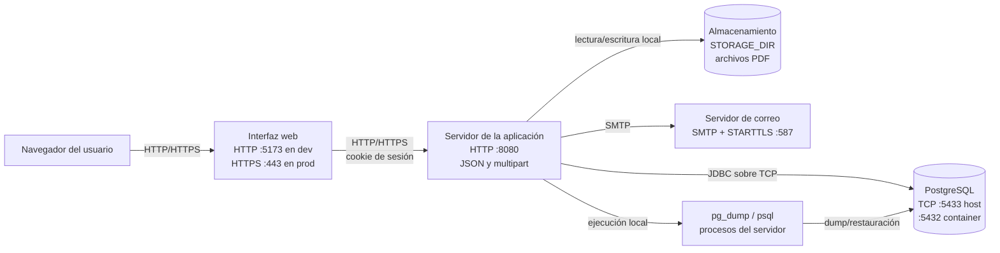

# Digesto – Escuela de Comercio Martín Zapata

Aplicación para cargar, revisar, aprobar, publicar y consultar normativas
institucionales en formato PDF, como disposiciones, resoluciones y circulares.

El sistema tiene dos usos principales, cada una con su interfaz:

- **Sitio público:** permite buscar y consultar las normativas publicadas.
- **Panel administrativo:** permite cargar documentos, gestionar usuarios, publicaciones y catálogos y realizar backups.

## Arquitectura

La aplicación está formada por una interfaz, un servidor, una base de
datos y un almacenamiento (volumen de persistencia). En desarrollo (dev) se ejecutan por separado mientras que en
producción (prod) normalmente se colocan detrás de un servidor web con HTTPS.



### Componentes

- **Navegador:** muestra el sitio público y el panel administrativo. Envía las
  peticiones al servidor y conserva la cookie de sesión.
- **Interfaz web:** presenta formularios, búsquedas, filtros, estados de carga y
  mensajes de error. En dev se sirve en el puerto `5173`.
- **Servidor de la app:** escucha en el puerto `8080`, recibe solicitudes
  HTTP, comprueba permisos, valida campos y ejecuta operaciones.
  Devuelve sus respuestas en JSON, y para cargar documentos requiere el formato `multipart/form-data`.
- **DBMS PostgreSQL:** guarda usuarios, normativas, autoridades, tipos de documento,
  expedientes, notificaciones y configuración. En Docker se publica como
  `localhost:5433` y dentro del contenedor escucha en `5432`.
- **Almacenamiento:** es una carpeta indicada por
  `STORAGE_DIR` (que por defecto es `./data/archivos`) en la que se guardan los PDF.
- **Servidor de correo:** se comunica mediante SMTP por el puerto
  `587`. Se usa para recuperar contraseñas, informar nuevas
  cuentas y notificar publicaciones. Si no se configura en dev, el
  sistema registra el intento de envío de correo y continúa.
- **`pg_dump` y `psql`:** son programas instalados en el servidor. El primero
  genera el volcado de la base para un backup y el segundo lo utiliza al
  restaurarlo.

### Secuencia de una petición

1. El usuario realiza una acción en el navegador.
2. La interfaz envía una solicitud HTTP al servidor, incluyendo la cookie de
   sesión cuando la operación requiere autenticación.
3. El servidor valida los datos y el rol del usuario.
4. Si corresponde, lee o actualiza PostgreSQL y accede al raw PDF en
   `STORAGE_DIR`.
5. El servidor responde con JSON, un PDF o un archivo ZIP, según la operación.

Las operaciones habituales usan JSON. La creación y edición de normativas envían
un formulario `multipart` con los datos de la normativa y el PDF. Las descargas de
PDF conservan la sesión del usuario y permiten abrir el documento o descargarlo.

## Estados de una normativa

Una normativa puede pasar por estos estados:

1. **Borrador:** fue cargada pero todavía no se envió a revisión.
2. **Pendiente:** fue enviada a revisión.
3. **Publicada:** fue aprobada y es visible en el sitio público.

Cuando se modifica una normativa publicada, deja de mostrarse publicada hasta que la nueva versión sea aprobada. Si la
modificación se rechaza, se restaura la versión anterior.

## Requisitos

Para trabajar localmente se necesita:

- Java 25.
- Maven, o utilizar el archivo `backend/mvnw`.
- Node.js y npm.
- Docker y Docker Compose.
- PostgreSQL 16 o su imagen en Docker.

Para backups y restauraciones también deben estar disponibles los comandos
`pg_dump` y `psql`.

## Desarrollo local (dev)

### 1. Iniciar la base de datos

Desde la raíz del repositorio:

```bash
cd backend
docker compose up --detach
```

La opción `--detach` se usa para correr los containers en el background.
La DB queda disponible en `localhost:5433`.

### 2. Configurar el frontend

Crear `frontend/.env.development` a partir de `frontend/.env.example`:

```bash
cp frontend/.env.example frontend/.env.development
```

Aquí está la URL del backend de Spring Boot.

### 3. Iniciar el backend

En una terminal:

```bash
cd backend
./mvnw spring-boot:run
```

El servidor queda disponible en:

```text
http://localhost:8080
```

### 4. Iniciar el frontend

En otra terminal:

```bash
cd frontend
npm install
npm run dev
```

El frontend queda disponible en:

```text
http://localhost:5173
```

### Usuarios por defecto

En una base nueva, el sistema crea estas cuentas:

| Usuario                            | Contraseña |
|------------------------------------|--------------------|
| `admin@mzapata.uncuyo.edu.ar`      | `admin`            |
| `superadmin@mzapata.uncuyo.edu.ar` | `superadmin`       |

La primera vez que ingresan deben cambiar la contraseña. Estas credenciales son
solo para desarrollo y deben cambiarse antes de publicar el sistema.

También se crean automáticamente los tipos de normativa y autoridades iniciales.

## Uso del panel administrativo

Un admin puede:

- Crear y editar normativas.
- Guardarlas como borrador o enviarlas a aprobación.
- Administrar tipos de documento y autoridades.
- Consultar y descargar PDFs.
- Cambiar su propia contraseña.

Un superadmin, además, puede:

- Aprobar o rechazar normativas.
- Administrar usuarios.
- Configurar la plantilla de correo.
- Generar y restaurar backups.

El sitio público solo muestra normativas aprobadas y publicadas.

## API

La API está disponible bajo `http://localhost:8080/api` en desarrollo. En
producción debe publicarse bajo el dominio definido por la instalación.

### Autenticación

| Método | Ruta                    | Descripción                                  |
|--------|-------------------------|----------------------------------------------|
| `POST` | `/auth/login`           | Inicia sesión con email y contraseña         |
| `GET`  | `/auth/me`              | Devuelve el usuario de la sesión actual      |
| `POST` | `/auth/logout`          | Cierra la sesión                             |
| `POST` | `/auth/change-password` | Cambia la contraseña del usuario actual      |
| `POST` | `/auth/forgot-password` | Solicita un enlace de recuperación           |
| `POST` | `/auth/reset-password`  | Define una nueva contraseña usando el enlace |

### Consulta pública

| Método | Ruta                       | Descripción                                          |
|--------|----------------------------|------------------------------------------------------|
| `GET`  | `/normativas`              | Busca normativas publicadas con filtros y paginación |
| `GET`  | `/normativas/{id}`         | Consulta el detalle de una normativa publicada       |
| `GET`  | `/normativas/{id}/archivo` | Visualiza o descarga su PDF                          |
| `GET`  | `/tipos-documento`         | Lista los tipos de normativa                         |
| `GET`  | `/autoridades`             | Lista las autoridades                                |

La búsqueda de normativas admite texto, tipo, autoridad, año, número,
expediente y rango de fechas.

### Administración de normativas

| Método   | Ruta                                  | Descripción                               |
|----------|---------------------------------------|-------------------------------------------|
| `GET`    | `/admin/normativas`                   | Lista normativas del panel administrativo |
| `GET`    | `/admin/normativas/expediente-en-uso` | Informa si un expediente ya fue utilizado |
| `GET`    | `/admin/normativas/{id}`              | Consulta el detalle administrativo        |
| `GET`    | `/admin/normativas/{id}/archivo`      | Visualiza o descarga un PDF del panel     |
| `POST`   | `/admin/normativas`                   | Crea una normativa y carga su PDF         |
| `PUT`    | `/admin/normativas/{id}`              | Edita una normativa                       |
| `DELETE` | `/admin/normativas/{id}`              | Elimina lógicamente una normativa         |
| `POST`   | `/admin/normativas/{id}/aprobar`      | Aprueba y publica una normativa           |
| `POST`   | `/admin/normativas/{id}/rechazar`     | Rechaza una normativa                     |

La creación y edición requieren una sesión. Aprobar y rechazar requieren el rol de superadmin.

### Usuarios, catálogos y correo

| Método                  | Ruta                      | Descripción                                |
|-------------------------|---------------------------|--------------------------------------------|
| `POST`, `PUT`, `DELETE` | `/tipos-documento`        | Administra tipos de normativa              |
| `POST`, `PUT`, `DELETE` | `/autoridades`            | Administra autoridades                     |
| `GET`, `POST`           | `/admin/usuarios`         | Lista y crea usuarios                      |
| `PUT`, `DELETE`         | `/admin/usuarios/{id}`    | Edita o elimina usuarios                   |
| `GET`, `PUT`            | `/admin/plantilla-correo` | Consulta o modifica la plantilla de correo |

La gestión de usuarios y backups está reservada al superadmin.
Tipos, autoridades y plantilla de correo requieren una sesión autenticada.

### Backups

| Método | Ruta                       | Descripción                          |
|--------|----------------------------|--------------------------------------|
| `GET`  | `/admin/backups/estado`    | Consulta el estado del último backup |
| `GET`  | `/admin/backups`           | Genera y descarga un ZIP             |
| `POST` | `/admin/backups/restaurar` | Valida y restaura un ZIP             |

Las respuestas de error utilizan un mensaje legible y, cuando corresponde,
detalles por campo para que la interfaz pueda mostrarlos en los formularios.

## Configuración

La configuración principal está en:

```text
backend/src/main/resources/application.properties
```

Las variables más relevantes son:

| Variable        | Uso                                                                          |
|-----------------|------------------------------------------------------------------------------|
| `MAIL_HOST`     | Servidor de correo. Si no se define, los correos se registran y no se envían |
| `MAIL_PORT`     | Puerto del servidor de correo, normalmente `587`                             |
| `MAIL_USERNAME` | Usuario del correo                                                           |
| `MAIL_PASSWORD` | Contraseña del correo                                                        |
| `MAIL_FROM`     | Dirección que aparece como remitente                                         |
| `STORAGE_DIR`   | Carpeta donde se guardan los PDF                                             |
| `PG_DUMP`       | Ubicación de `pg_dump`                                                       |
| `PSQL`          | Ubicación de `psql`                                                          |

No deben guardarse contraseñas reales en el repositorio.

## Backups

El panel del administrador principal permite descargar un backup que contiene:

- Una copia de la base de datos.
- Un listado de los archivos relacionados.
- Los PDF almacenados.

La restauración solicita la contraseña del administrador principal y valida el
archivo antes de iniciar el proceso. Se recomienda conservar los backups fuera
del servidor y probar periódicamente su restauración en un entorno separado.

## Producción

La forma de funcionamiento es la misma que en desarrollo, pero cambian la
infraestructura y la configuración.

### Preparar la base de datos

Utilizar una base PostgreSQL independiente y persistente. No utilizar las
credenciales de Docker del entorno local. Configurar la conexión mediante las
variables o propiedades de producción correspondientes.

En producción se recomienda no depender de la actualización automática del
esquema. El proyecto usa actualmente `ddl-auto=update`, que es práctico para
desarrollo; antes de un despliegue estable conviene revisar y versionar los
cambios de base de datos.

### Preparar el servidor

Generar el paquete del servidor:

```bash
cd backend
./mvnw clean package
```

El archivo generado queda en `backend/target/`. Ejecutarlo en un servidor con:

- Acceso a PostgreSQL.
- Una carpeta persistente para los PDF.
- `pg_dump` y `psql`.
- Las variables de correo configuradas si se necesitan notificaciones.

### Preparar la interfaz

Configurar la URL pública del servidor en una variable `VITE_API_URL` y generar
la versión para publicar:

```bash
cd frontend
npm install
npm run build
```

El resultado queda en `frontend/dist/`. Esa carpeta debe ser servida por un
servidor web, como Nginx, Apache o un servicio equivalente.

### Publicar detrás de un proxy

Una configuración habitual es:

```text
Internet
   │
   └── Servidor web con HTTPS
       ├── Archivos del frontend
       └── Solicitudes /api → servidor de la aplicación :8080
```

El repositorio no incluye una configuración automática de producción, Dockerfiles
ni un pipeline de publicación. Esas piezas deben definirse según el servidor o
proveedor elegido.


